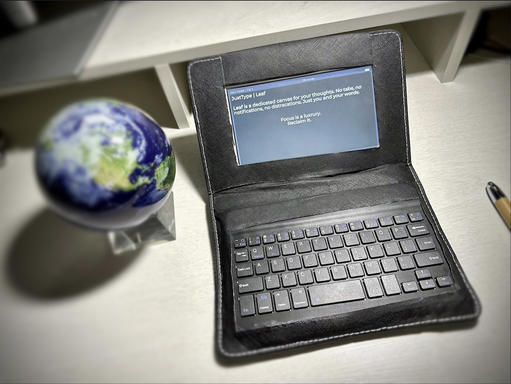
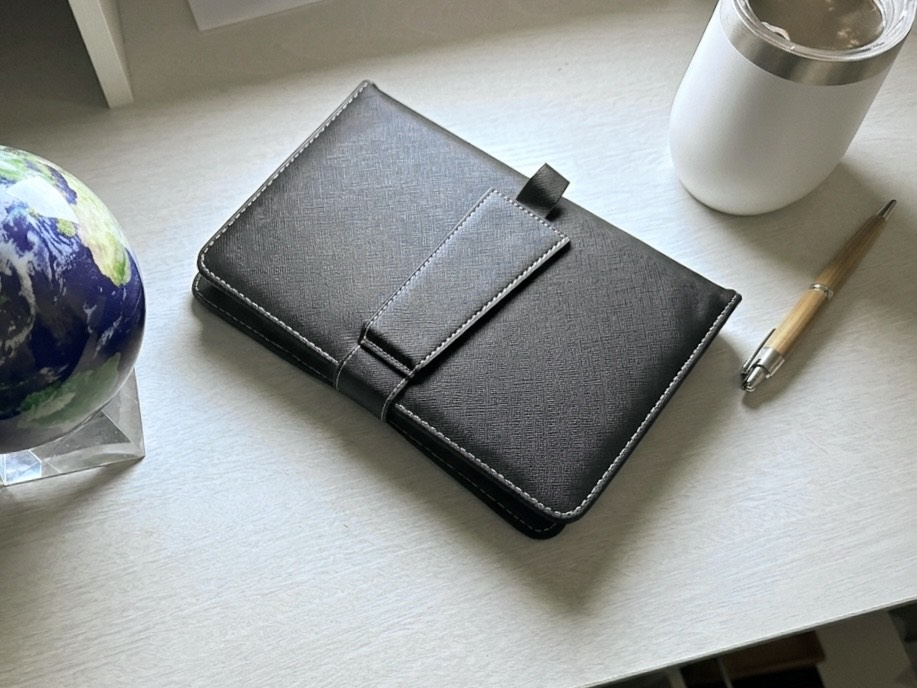
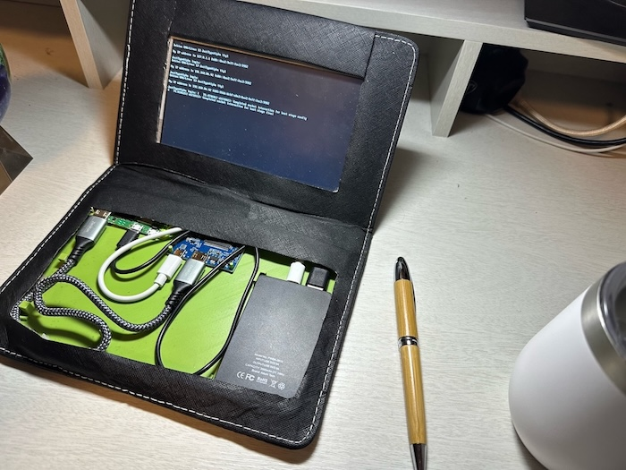

# JustType LVGL





A distraction-free text editor built with LVGL, designed for embedded MCUs. This is a port of the [original JustType editor](https://github.com/YonahKarp/cppEdit) from SDL/Nuklear to LVGL.

## Features

- Boots straight into a writing interface
- Auto-saves edits using a debounce timer: changes are buffered in memory, then flushed to disk after a short idle window to reduce write frequency while keeping data loss risk low
- Remembers editor state so the user can pick up where they left off
- Includes a file sidebar, in-editor search, and keyboard-first controls
- Built-in keyboard shortcuts focused on writing flow (for example: `Ctrl+Up` / `Ctrl+Down` paragraph jump, `Shift+Arrow` selection, `Ctrl+Backspace` delete previous word)
- Supports dark/light theme toggle and font size adjustment


#### *NEW:*
- QR code export
- Folder management 


## Prototype Hardware




- Raspberry Pi Zero 2W
- 7" 1024x600 display
- slim 3,000mAh power bank
- leather keyboard phone case.
- [3D printed internals](https://justtypeleaf.com/prototype-files?entry=home)

Follow the journey at 
[justtypeleaf.com/journey](https://justtypeleaf.com/journey?entry=home)

## Requirements

- CMake 3.14+
- C++17 compiler
- pthreads

### Platform-specific requirements

- `PLATFORM=sdl` (default): SDL2 + `pkg-config`
- `PLATFORM=linux_fb`: Linux framebuffer + evdev devices (`/dev/fb*`, `/dev/input/event*`)

## Building

### macOS (SDL)

```bash
# dependencies
brew install sdl2 pkg-config

# Configure + build
cmake -S . -B build -DPLATFORM=sdl
cmake --build build -j

# Run
./build/justtype_lvgl
```

### Linux (SDL, recommended)

```bash
# dependencies
sudo apt update
sudo apt install -y build-essential cmake pkg-config libsdl2-dev

# Configure + build
cmake -S . -B build -DPLATFORM=sdl
cmake --build build -j

# Run
./build/justtype_lvgl
```

### Linux (Framebuffer + evdev)

This target does **not** use SDL. It is intended for direct Linux console/framebuffer usage.

```bash
# dependencies
sudo apt update
sudo apt install -y build-essential cmake linux-libc-dev

# Configure + build
cmake -S . -B build-fb -DPLATFORM=linux_fb
cmake --build build-fb -j

# Run (usually needs device access to /dev/fb0 and /dev/input/event*)
sudo ./build-fb/justtype_lvgl
```

Optional runtime device overrides:

```bash
JUSTTYPE_FBDEV=/dev/fb1 JUSTTYPE_EVDEV=/dev/input/event3 sudo ./build-fb/justtype_lvgl
```
